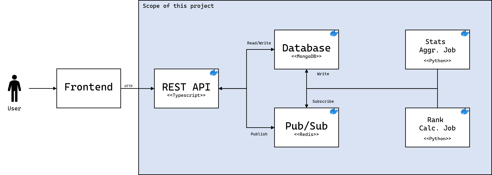
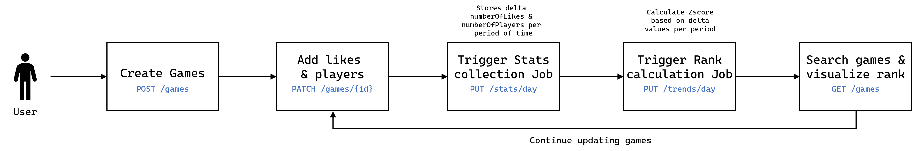

# Game Database: Storage and Trending

This project consists of a REST API on top of MongoDB and Redis, allowing users to perform CRUD operations on Game data. Additionally, to provide valuable insights to the users, I built a couple of background jobs that aggregate the relevant game statistics in a periodic basis, and calculates the rank and relevance of the game objects using a ZScore.

The components are highly customizable, with interfaces in all moving places to properly replace and enhance the functionality. The REST API was built on top of typescript and the backend jobs with Python.

The REST API is fully OpenAPI V3 and JSON:API compliant for easy consumption and integration.

## Architecture



The REST API is the front facing part of the application and it was written in Typescript. It manages user input and store Game objects on MongoDB. It also exposes a couple endpoints to publish messages to a couple Redis queues: one to trigger stats accumulation for the game objects on a daily, and eventually monthly and yearly basis; and a second one to calculate how the game ranks among all other games in the database, so the trending objects can be explored.

Both Jobs run on top of Python, which opens the door for different types of data manipulation and analysis capabilities. They listen to messages on the Redis queues, do the stats accumulation, and write the final rankings back to the Mongo database.

For more details on each one of these components please go the [REST API documentation](./backend/README.md) and the [Jobs documentation](./trending/README.md).

### Project Structure

The codebase structure is organized according to the functional aspects of each file and dependency. Each folder hosts relevant data or code for each capability.

* `backend`: holds the entire REST API implementation using Typescript.
* `build`: holds the `docker-compose.yaml` as well as the `Dockerfile`'s for the API and the background jobs.
* `spec`: holds the OpenAPI spec file. This was generated manually as part of the solution design. The types within the frontend and the background jobs are derived from this specification.
* `trending`: holds the background jobs code written in Python.
* `docs`: contains resources needed for the overall project documentation.

## Project execution

### Running all components

The project can be easily executed on top of Docker and Docker compose. Please ensure these components are installed locally on your machine. The project includes a convenient `Makefile` to simplify the building process, so feel free to just execute:

```bash
make run
```

The app will use the ports `8081` for the API, `27017` for the MongoDB instance, and `6379`for Redis. You will be able to access the api by hitting [http://localhost:8081/docs](http://localhost:8081/docs)

### Executing the API test suite

The API can be tested harnessing Docker and docker compose. Please ensure these components are installed locally on your machine. The project includes a convenient `Makefile` to simplify the test execution process, so feel free to just run:

```bash
make test
```

## End-to-end logic



To fully test the project ensure all components are running in the `docker-compose`. Then proceed to create `Game` objects in the database harnessing the API endpoints. For more details on the entire API specification, please visit the [documentation](http://localhost:8081/docs).

Please start by creating game objects in the database. To do so, harness `insomnia`, `postman`, `cURL`, or any other HTTP clients. The endpoint for this purpose is `POST /v1/games`. You can easily achieve that by executing the next cURL request:

```bash
curl --location 'http://localhost:8081/v1/games' \
--header 'Content-Type: application/json' \
--data '{
    "attributes": {
        "title": "The Legend Of Zelda: Unannounced"
    }
}'
```

A successful request will showcase the next body:

```json
{
	"data": {
		"type": "games",
		"id": "646261eba9e405958651e7e5",
		"attributes": {
			"title": "The Legend Of Zelda: Unannounced",
			"numberOfLikes": 0,
			"numberOfPlayers": 0,
			"rank": -1,
			"createdAt": "2023-05-15T16:46:35.895Z",
			"updatedAt": "2023-05-15T16:46:35.895Z"
		}
	}
}
```

Then, start accumulating stats per game. The available stats to track are `numberOfLikes` and `numberOfPlayers`. To do so, please execute the endpoint `PATCH /v1/games/{id}`. This endpoint is [RFC 6902](https://datatracker.ietf.org/doc/html/rfc6902) compliant, and executes a JSON patch according to the operations specification. This sample `cURL` query will help you update the game objects.

```bash
curl --location --globoff --request GET 'http://localhost:8081/v1/games/{id}' \
--header 'Content-Type: application/json' \
--data '[
	{
		"op": "inc",
		"path": "/numberOfLikes",
		"inc": 50
	},
	{
		"op": "inc",
		"path": "/numberOfPlayers",
		"inc": 700
	}
]'
```

A single object reflecting the requested updates will return:

```json
{
	"data": {
		"type": "games",
		"id": "64625be0982bb61498adc294",
		"attributes": {
			"title": "The Legend Of Zelda: Tears Of The Kingdom",
			"numberOfLikes": 50,
			"numberOfPlayers": 700,
			"rank": -1,
			"createdAt": "2023-05-15T16:20:48.814Z",
			"updatedAt": "2023-05-15T16:20:50.546Z"
		}
	}
}
```

Afterwards, the stats accumulation job can be triggered. A container running the underlying Python app, is subscribed to a given `redis` queue. To send a message to this queue you can harness one of the available endpoints: `PUT /v1/stats/day`. As of this moment the only period of time supported is `day` but the code is easy to enhance to kick-off the accumulation of `monthly`, `yearly`, or any other period stat.

```bash
curl --location --request PUT 'http://localhost:8081/v1/stats/day'
```

This will return the next response:

```json
{
	"meta": {
		"status": "Job triggered successfully"
	}
}
```

The Python job will be triggered and the container logs will reflect its operation. A new collection will be created in the database, the `game_stats` collection, that will hold the accumulation of daily stats per game in a list of embedded documents.

Afterward, we can trigger the rank calculation job. This is also running in a container holding a Python app that is also listening to a `redis` queue. To send a message to such queue, please call the endpoint `PUT /v1/trends/day`. As the stats accumulation job, this receives a daily period, which is already implemented, and can be easily extensible to add other periods of time.

This job triggers a ZScore calculation for the daily delta of likes and players, and based on this it ranks the games with an integer value, being `0` the most relevant game. The game objects will be updated by this job and the `rank` attribute will be updated. 

Now the ranked list can be explored. For this the `GET /v1/games` endpoint can be harnessed:

```bash
curl --location --globoff 'http://localhost:8081/v1/games'
```

This will return a paginated list of results, along with the links to continue navigating the records:

```json
{
	"data": [
		{
			"type": "games",
			"id": "646260d62d983eb67df90e1f",
			"attributes": {
				"title": "The Legend of Zelda: Tears Of The Kingdom",
				"numberOfLikes": 10,
				"numberOfPlayers": 5,
				"rank": -1,
				"createdAt": "2023-05-15T16:41:58.229Z",
				"updatedAt": "2023-05-15T16:41:58.233Z"
			}
		}
	],
	"links": {
		"current": "/v1/games?page[number]=1&page[size]=10",
		"first": "/v1/games?page[number]=1&page[size]=10",
		"next": "/v1/games?page[number]=3&page[size]=10",
		"last": "/v1/games?page[number]=1&page[size]=10"
	},
	"meta": {
		"count": 1
	}
}

```

Now, it is all about iterating. The games can continue being updated, and on a daily basis, the stats accumulation job can be triggered to capture the deltas, followed by the trend calculation job to establish the new ranks.

## How to contribute

Any contributions you make are greatly appreciated. If you have a suggestion that would make this better, please fork the repo and create a pull request. For more details follow the [Contribution guidelines](./CONTRIBUTING.md).

## Contact

Ricardo Santos Diaz - https://www.linkedin.com/in/ricardosantosdiaz/
